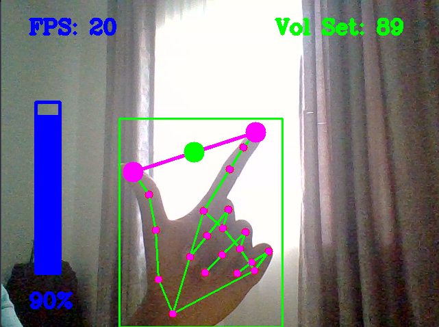

<h1 align="center">Hand Gesture Volume Control</h1>

This is a program that controls the system volume using hand gestures



## Requirements
* Opencv - library for real-time computer vision
* Numpy - library to perform mathematical functions
* Mediapipe - library for the hand landmarks
* pycaw - python library designed exclusively for controlling audio devices on Windows systems

## Install
Run this in terminal

```bash
pip install opencv-python numpy mediapipe pycaw
```

## Program Features
* Adjust distance between thumb and index finger to contol the volume
* Fold pinkey finger to set the volume
* FPS measured
* Visual effect of the volume control

### hand_landmarker.task
A model that detects the keypoints of the 21 hand-knuckle coordinates within the detected hand regions.

### HandTrackingModule.py
Module that contains functions for the detection of the hands, position of the fingers, drawing the hand landmarks and bounding box around the hand for easy reuse

### VolumeHandControl.py
Simple version of the program to change the volume settings of the system.

### VolumeHandControlAdvanced.py
More advanced version that allows smoth control of the volume with additional feature to set the volume when the pinky finger folds

